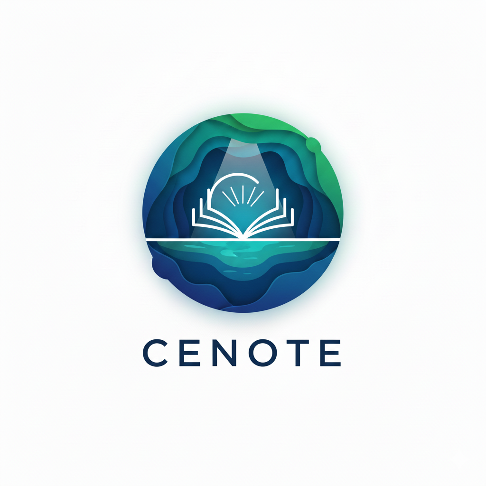

  <picture>
    
  </picture>

Students are constantly exposed to unproductive temptations with unrestricted browsing and desktop applications on their general-purpose computers while parents and educators rely on fragile, by-passable controls. 

Cenote solves this by replacing the traditional desktop with a distraction-free learning environment that supports deep focus and controlled access to resources.

 

Go and follow [Cenote](https://github.com/CenoteLearning) to see how the product develops. We hope to have an MVP out by the beginning of March 2026! 

### Core Team

<table>
  <tr>
    <td align="center"><a href="https://github.com/zachariaswik"> <b>Erik</b></a> <a href="#SoftwareDevelopment-Fernando" title="Software Development">💻💼</a></td>
  </tr>
</table>
 

### Contributors ✨

<!-- ALL-CONTRIBUTORS-LIST:START - Do not remove or modify this section -->
<!-- prettier-ignore-start -->
<!-- markdownlint-disable -->
<table>
  <tr>
    <td align="center"><a href="https://github.com/sito8943"> <b>Carlos</b></a> <a href="#SoftwareDevelopment-Carlos" title="Software Development">💻</a></td>
  </tr>
</table>

<!-- markdownlint-restore -->
<!-- prettier-ignore-end -->

<!-- ALL-CONTRIBUTORS-LIST:END -->

