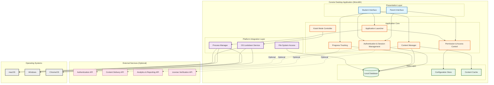

```mermaid
graph TB
    subgraph "Cenote Desktop Application (Monolith)"
        subgraph "Presentation Layer"
            ParentUI[Parent Interface]
            StudentUI[Student Interface]
        end
        
        subgraph "Application Core"
            Auth[Authentication & Session Management]
            ContentMgr[Content Manager]
            PermissionCtrl[Permission & Access Control]
            KioskMode[Kiosk Mode Controller]
            AppLauncher[Application Launcher]
            ProgressTrack[Progress Tracking]
        end
        
        subgraph "Platform Integration Layer"
            OSLock[OS Lockdown Service]
            FileSystem[File System Access]
            ProcessMgr[Process Manager]
        end
        
        subgraph "Data Layer"
            LocalDB[(Local Database)]
            ConfigStore[Configuration Store]
            ContentCache[Content Cache]
        end
    end
    
    subgraph "External Services (Optional)"
        AuthAPI[Authentication API]
        ContentAPI[Content Delivery API]
        AnalyticsAPI[Analytics & Reporting API]
        LicenseAPI[License Verification API]
    end
    
    subgraph "Operating Systems"
        MacOS[macOS]
        Windows[Windows]
        ChromeOS[ChromeOS]
    end
    
    %% UI Connections
    ParentUI --> Auth
    ParentUI --> PermissionCtrl
    ParentUI --> ProgressTrack
    StudentUI --> Auth
    StudentUI --> ContentMgr
    StudentUI --> AppLauncher
    
    %% Core Connections
    Auth --> LocalDB
    ContentMgr --> ContentCache
    ContentMgr --> LocalDB
    PermissionCtrl --> ConfigStore
    KioskMode --> OSLock
    AppLauncher --> ProcessMgr
    AppLauncher --> PermissionCtrl
    ProgressTrack --> LocalDB
    
    %% Platform Connections
    OSLock --> MacOS
    OSLock --> Windows
    OSLock --> ChromeOS
    FileSystem --> LocalDB
    ProcessMgr --> MacOS
    ProcessMgr --> Windows
    ProcessMgr --> ChromeOS
    
    %% External API Connections
    Auth -.->|Optional| AuthAPI
    ContentMgr -.->|Optional| ContentAPI
    ProgressTrack -.->|Optional| AnalyticsAPI
    Auth -.->|Optional| LicenseAPI
    
    %% Styling
    classDef uiLayer fill:#e1f5ff,stroke:#01579b,stroke-width:2px
    classDef coreLayer fill:#fff3e0,stroke:#e65100,stroke-width:2px
    classDef platformLayer fill:#f3e5f5,stroke:#4a148c,stroke-width:2px
    classDef dataLayer fill:#e8f5e9,stroke:#1b5e20,stroke-width:2px
    classDef external fill:#fce4ec,stroke:#880e4f,stroke-width:2px,stroke-dasharray: 5 5
    classDef os fill:#eeeeee,stroke:#424242,stroke-width:2px
    
    class ParentUI,StudentUI uiLayer
    class Auth,ContentMgr,PermissionCtrl,KioskMode,AppLauncher,ProgressTrack coreLayer
    class OSLock,FileSystem,ProcessMgr platformLayer
    class LocalDB,ConfigStore,ContentCache dataLayer
    class AuthAPI,ContentAPI,AnalyticsAPI,LicenseAPI external
    class MacOS,Windows,ChromeOS os
		
```